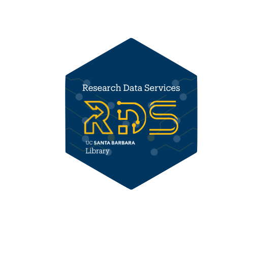

## Tidying Messy Spreadsheets with OpenRefine

This website aims to help researchers to get acquainted with [OpenRefine](https://openrefine.org) and its features to support data cleaning, a powerful open-source and non-programmer friendly tool designed to clean, transform, and structure messy datasets with efficiency and precision. By learning how to identify and resolve common data quality issues, you will gain the skills needed to ensure that your spreadsheets are reliable, standardized, and ready for deeper analysis. Whether you're working with survey results, bibliographic records, recorded observations, financial reports, or any other tabular data, mastering data-cleaning techniques will enhance the integrity and reusability of your datasets.

In this hands-on workshop, you'll learn how to efficiently clean, transform, and structure messy spreadsheets using OpenRefine, a powerful open-source tool for data wrangling. Whether you're tackling inconsistencies, duplicates, or complex formatting challenges, OpenRefine enables you to automate and streamline the process, ensuring greater accuracy and consistency in your datasets.

Throughout this session, we will explore how to:

-   Analyze and diagnose data issues using facets, clustering, and structured views to identify inconsistencies.
-   Filter and refine data by removing irrelevant observations and keeping only records that meet specific criteria.
-   Standardize and reconcile values to maintain consistent spelling and formatting across entries, leveraging OpenRefine’s clustering and reconciliation features.
-   Transform and manipulate data using built-in transformations and the General Refine Expression Language (GREL) for advanced modifications.
-   Document and export workflows to ensure reproducibility and share cleaned datasets with collaborators.

By applying facets, sorting, clustering, GREL expressions, and reconciliation, you'll gain hands-on experience in making messy data more structured, usable, and analysis-ready. Whether you're a researcher, librarian, or data professional, this workshop will equip you with practical skills to enhance your data management workflow.

*If you have comments or feedback, please use the [issues](https://github.com/UCSB-Library-Research-Data-Services/qualdata-training/blob/main/enter%20URL%20for%20issues) repository feature*

### **Authors:**

Renata Curty ([rcurty\@ucsb.edu](mailto:rcurty@ucsb.edu))

CC-BY

{width="156"}
